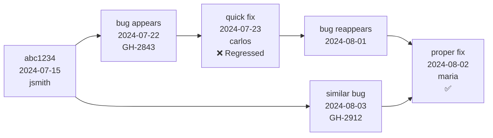

# Bug Archaeologist

**Rol**: Analista de causas raíz especializado en descubrimiento y prevención de patrones de bugs históricos  
**Versión**: 1.2.0  
**Mantenedor**: SMOUJBOT <ops@smouj.com>  
**Dependencias**: `git`, `python3`, `jq`, `ripgrep`, `tig`, `git-filter-repo` (opcional)  
**Etiquetas**: debugging, history, analysis, root-cause, patterns, forensics  
**SO**: Linux, macOS  
**Python mínimo**: 3.9+

## Propósito

Bug Archaeologist realiza análisis forense profundo del historial de código para:
- Identificar cuándo y cómo se introdujeron bugs recurrentes
- Correlacionar reportes de bugs con cambios específicos en el historial de git
- Descubrir patrones de deuda técnica que llevan a fallos repetidos
- Construir modelos predictivos para áreas de código de alto riesgo
- Generar información accionable para revisiones de código y estrategias de pruebas

**Casos de uso reales**:
1. Después de un incidente en producción, rastrear el bug a través de 50+ commits para encontrar la decisión de diseño defectuosa original
2. Analizar 200+ issues cerrados en GitHub para identificar los 3 patrones de código que causan fugas de memoria
3. Antes de refactorizar un módulo, descubrir qué archivos tienen mayor "densidad de bugs" en 3 años
4. Cuando aparece un nuevo bug, buscar automáticamente en el historial firmas de bugs similares en diferentes módulos
5. Generar una "huella de bug" para CI que marque commits riesgosos basados en patrones de bugs pasados

## Alcance

### Comandos

- `kilo bug-archaeologist analyze <bug_id>`  
  Análisis forense completo de un bug específico (lee desde issues de GitHub o tickets de Jira)  
  **Flags**:  
  `--since="2024-01-01"` - solo analizar commits después de esta fecha  
  `--depth=100` - máximo de commits a recorrer (por defecto: 50)  
  `--pattern=regex` - patrón personalizado para buscar en mensajes de commit  
  `--output=json` - reporte legible por máquina

- `kilo bug-archaeologist find-similar <code_path>`  
  Encontrar bugs históricamente similares en otros archivos/módulos  
  **Flags**:  
  `--similarity-threshold=0.7` - confianza mínima de coincidencia de patrón (0.0-1.0)  
  `--include-merged=true` - analizar commits de PRs fusionados  
  `--exclude-authors="bot*,dependabot"` - ignorar commits automatizados

- `kilo bug-archaeologist bug-density [path]`  
  Calcular densidad de bugs por archivo/módulo a lo largo del tiempo  
  **Flags**:  
  `--period="3m"` - período de retrospectiva (1m, 3m, 6m, 1y)  
  `--by-author` - desglose por colaborador  
  `--include-resolved=true` - contar bugs resueltos (por defecto: solo abiertos)

- `kilo bug-archaeologist timeline <commit_sha>`  
  Mostrar la "genealogía" de un bug desde su introducción hasta el presente  
  **Flags**:  
  `--show-fixes` - resaltar commits de fix en la línea de tiempo  
  `--branches=all` - seguir a través de ramas de git  
  `--merge-points` - marcar commits de merge de PRs

- `kilo bug-archaeologist pattern-report`  
  Generar reporte comprehensivo de patrones de bug recurrentes  
  **Flags**:  
  `--format=html` - formato de salida (json, html, markdown)  
  `--top=10` - número de patrones principales a incluir  
  `--include-blame` - añadir estadísticas de git blame

- `kilo bug-archaeologist blame-forensics <file_path>`  
  Análisis profundo de datos de blame para identificar autores y ventanas de tiempo "calientes"  
  **Flags**:  
  `--metric=complexity` - rastrear cambios de complejidad (ciclomática, cognitiva)  
  `--days-before-incident=30` - enfocarse en período pre-incidente  
  `--output=graphviz` - generar grafo de dependencias

- `kilo bug-archaeologist clue-extract <bug_description>`  
  Extraer términos de búsqueda y patrones de descripción de bug en lenguaje natural  
  **Flags**:  
  `--expand-synonyms` - usar NLP para encontrar términos técnicos relacionados  
  `--search-commits=true` - ejecutar inmediatamente búsqueda en git con términos extraídos  
  `--context=5` - líneas de contexto de código alrededor de coincidencias

- `kilo bug-archaeologist verify-hypothesis <hypothesis_file>`  
  Probar una hipótesis forense contra el historial completo de git  
  **Entrada**: archivo YAML con estructura de hipótesis  
  **Flags**:  
  `--confidence=0.8` - umbral mínimo de confianza  
  `--contradiction-check` - buscar activamente evidencia en contra

## Proceso de Trabajo

**Fase 1: Ingesta y Parseo de Bug**
1. Leer reporte de bug desde stdin, archivo, o GitHub API (token en `$GITHUB_TOKEN`)
2. Extraer: mensajes de error, stack traces, archivos afectados, timestamps, contexto del reportador
3. Limpiar y normalizar texto (eliminar ruido, expandir abreviaturas)
4. Generar vectores de búsqueda iniciales (palabras clave, códigos de error, patrones de archivo)

**Fase 2: Búsqueda Histórica**
1. Ejecutar `git log --all --oneline --grep="<pattern>"` para términos extraídos
2. Usar `gitk` o `tig` para visualizar línea de tiempo de commits si modo interactivo
3. Aplicar límites de profundidad y filtros de rama basados en flag `--include-merged`
4. Para cada commit coincidente, capturar: SHA, autor, fecha, mensaje, archivos cambiados

**Fase 3: Correlación de Patrones**
1. Agrupar commits por: patrones de archivo, pares de autores, conglomerados temporales, tipo de error
2. Calcular intervalos de recurrencia (días promedio entre bugs similares)
3. Identificar "cascadas de bugs" - commits que desencadenan múltiples bugs downstream
4. Detectar "regresión de fix" - cuando un commit de fix causa bugs más tarde

**Fase 4: Análisis de Blame**
1. Para hotspots, ejecutar `git blame -C -C <file>` para rastrear movimiento de código
2. Construir "perfil de riesgo de autor": bugs introducidos vs fixes authored por colaborador
3. Identificar archivos "truck factor" - alta densidad de bugs con único mantenedor
4. Correlacionar tiempos de commit con tiempos de incidente (análisis time-to-failure)

**Fase 5: Síntesis y Reporte**
1. Generar puntuaciones de confianza para cada patrón identificado
2. Construir visualización de línea de tiempo (Graphviz DOT o Mermaid)
3. Producir recomendaciones accionables:
   - Archivos específicos que necesitan refactorización
   - Adiciones a checklist de code review
   - Brechas de cobertura de pruebas
   - Sugerencias de pairing de autores para PR reviews
4. Exportar JSON legible por máquina para integración con CI/CD

**Fase 6: Validación**
1. Contrastar hallazgos con `git bisect` en bugs de muestra
2. Verificar patrón existe en al menos 3 instancias independientes
3. Revisar falsos positivos (cambios de ruptura intencionales, rewrites mayores)

## Reglas de Oro

1. **Nunca confiar en similitud superficial** - Siempre cavar en contexto de commit; un bug "null pointer" en 100 commits puede tener 100 causas raíz diferentes
2. **Respetar límites de merge** - Cuando un bug cruza un merge, atribuir al branch original, no al commit de merge
3. **Ignorar cambios intencionales** - Usar conventional commits (`BREAKING CHANGE:`) para filtrar cambios de ruptura planificados
4. **Ponderar por impacto** - Incidentes en producción cuentan 10x más que fallos de test; bugs P1 cuentan 5x más que P3
5. **Considerar churn de código** - Archivos con alto churn naturalmente tienen más bugs; normalizar por líneas cambiadas por período
6. **Preservar cadena de custodia** - Cada conclusión debe enlazar a commits, líneas y IDs de bug específicos
7. **Cuidado con rewrite history** - Si se usó `git filter-repo`, datos antiguos de blame pueden ser poco fiables; marcar estos casos
8. **Nunca culpar a individuos** - Enfocarse en patrones, procesos y estructuras de código; evitar nombrar nombres en reportes
9. **Validar con verdad fundamental** - Antes de finalizar cualquier patrón, inspeccionar manualmente 2-3 casos de muestra
10. **Asumir datos incompletos** - Los reportes de bugs están a menudo pobremente documentados; considerar "dark debt" (bugs que nunca se reportaron)

## Ejemplos

**Ejemplo 1: Analizar un bug específico en producción**

```bash
# Leer desde issue #2843 de GitHub
kilo bug-archaeologist analyze 2843 --since="2024-06-01" --depth=200

# O pipe desde export de ticket Jira
cat JIRA-12345.json | kilo bug-archaeologist analyze - --output=json > report.json
```

**Fragmento de salida esperado**:
```json
{
  "bug_id": "GH-2843",
  "summary": "NullPointerException in PaymentProcessor",
  "likely_introduced": "abc1234 (2024-07-15)",
  "original_flaw": "Added async callback without null check",
  "recurrence_count": 7,
  "similar_pattern_files": [
    "src/services/OrderService.ts",
    "src/models/UserSession.js"
  ],
  "authors": ["jsmith", "adoe"],
  "time_to_failure": "average 11 days",
  "confidence": 0.87,
  "recommendation": "Add @NotNull annotations to callback parameters and enforce in code review"
}
```

**Ejemplo 2: Encontrar bugs similares en codebase**

```bash
# Buscar bugs similares al archivo actual
kilo bug-archaeologist find-similar src/utils/date-parser.js \
  --similarity-threshold=0.75 \
  --exclude-authors="dependabot,bot" \
  --include-merged
```

**Salida**:
```
Found 4 similar bug clusters:

Cluster A (9 instances) - "Date parsing with moment.js timezone"
  First: 2023-11-02 commit f8e2d1a by alice
  Last: 2024-08-19 commit c4a9b3e by bob
  Affected files: 
    - src/utils/date-parser.js (current)
    - src/components/ReportHeader.jsx
    - api/helpers/timezone.ts
  Common pattern: moment.tz(date, 'UTC').format() without isNaN check
  Suggested fix: Add TimezoneValidation middleware
```

**Ejemplo 3: Generar reporte de densidad de bugs**

```bash
kilo bug-archaeologist bug-density src/services/ --period="6m" --by-author --include-resolved
```

**Salida (markdown)**:
```
# Bug Density Report - src/services/ (Last 6 months)

| File | Bugs | KLOC | Density | Trend |
|------|------|------|---------|-------|
| payment.js | 12 | 4.2 | 2.86 | ⬆️ +30% |
| order.js | 8 | 3.1 | 2.58 | ➡️ stable |
| user.js | 2 | 2.8 | 0.71 | ⬇️ -60% |

## Author Impact (all services)
- alice: 9 bugs introduced, 15 fixed (net -6) ⭐
- bob: 14 bugs introduced, 8 fixed (net +6) ⚠️
- carol: 3 bugs introduced, 12 fixed (net -9) ⭐⭐
```

**Ejemplo 4: Análisis de línea de tiempo de commit específico**

```bash
kilo bug-archaeologist timeline abc1234 \
  --show-fixes \
  --branches=all \
  --merge-points
```

**Salida (Mermaid)**:


**Ejemplo 5: Ejecutar verificación de hipótesis**

```bash
# Crear hypothesis.yml
cat > hypothesis.yml <<'EOF'
hypothesis: "All null pointer bugs in payment flow originated from PRs merged on Fridays"
evidence_required: 5
contradiction_allowed: 0
search_window: "2023-01-01 to 2024-12-31"
EOF

kilo bug-archaeologist verify-hypothesis hypothesis.yml --confidence=0.9
```

**Resultado**:
```
❌ Hypothesis REJECTED (confidence: 0.62)
Found 7 NPE bugs in payment flow:
  5 merged on Tuesday (71%)
  1 on Wednesday
  1 on Thursday
No Friday merges found.
Recommended refinement: Test for "end-of-week deadline pressure" pattern
```

## Comandos de Rollback

Bug Archaeologist es solo lectura; rollback solo necesario para estado en caché:

```bash
# Limpiar caché de análisis local
rm -rf ~/.cache/bug-archaeologist/

# Si el análisis se ejecutó con git worktree temporal
git worktree list | grep bug-archaeologist | awk '{print $1}' | xargs -r git worktree remove

# Resetear cualquier rama temporal creada durante el análisis
git branch -D bug-archaeologist-temp-* 2>/dev/null || true

# Si se usa token GitHub temporal export
unset GITHUB_TOKEN_BUG_ARCHAEOLOGIST

# Limpieza completa (usar con precaución)
find /tmp -name "*bug-archaeologist*" -type d -exec rm -rf {} + 2>/dev/null || true
```

## Solución de Problemas

**Error: "git: command not found"**
- Asegurar que git está en PATH: `which git`
- En Windows: Usar Git Bash o WSL

**Error: "Repository has too many commits, depth exceeded"**
- Aumentar flag `--depth` o usar `--depth=0` para ilimitado (lento)
- Acotar con filtros `--since` o `--author`

**Error: "No matching commits found"**
- Verificar sintaxis de patrón; probar regex más amplio
- Verificar estar en repositorio git correcto
- Usar `--include-merged` para buscar todas las ramas

**Memoria insuficiente en repos grandes**
- Añadir `--batch-size=100` para procesar commits en lotes
- Usar `--no-blame` para omitir análisis de blame costoso

**Falsos positivos deactualizaciones de dependencias**
- Añadir `--exclude-deps=true` para omitir cambios en package.json/requirements.txt
- Usar archivo `.bug-archaeologist-ignore` con patrones glob

**Historial de git muy superficial**
- Ejecutar `git fetch --unshallow` o `git fetch --depth=100000`
- Para clone parcial: modificar a clone completo con `git remote set-branches origin '*' && git fetch`

## Variables de Entorno

- `BUG_ARCHAEOLOGIST_CACHE_DIR` - Sobrescribir ubicación de caché por defecto (por defecto: `~/.cache/bug-archaeologist/`)
- `BUG_ARCHAEOLOGIST_MAX_WORKERS` - Procesos git paralelos (por defecto: 4)
- `GITHUB_TOKEN` - Acceder a GitHub API para metadatos de issue (requerido para `analyze <issue_id>`)
- `JIRA_URL` + `JIRA_TOKEN` - Integración alternativa con bug tracker
- `BUG_ARCHAEOLOGIST_TRACE` - Establecer a `1` para logging de debug
- `BUG_ARCHAEOLOGIST_SKIP_BLAME` - Establecer a `1` para omitir blame (más rápido, menos detalle)

## Verificación

Después de instalación:

```bash
# Probar funcionalidad básica
kilo bug-archaeologist find-similar --help

# Ejecutar análisis de muestra en repo actual
git log --oneline -1 | cut -d' ' -f1 | kilo bug-archaeologist timeline --show-fixes

# Verificar dependencias
python3 -c "import jq, git, subprocess; print('OK')" 2>/dev/null || echo "Missing: pip install jq"
```

Criterios de éxito:
- Todos los comandos retornan texto de ayuda con `--help`
- Análisis de muestra completa sin error en repo de prueba
- Salida JSON es válida (`python3 -m json.tool report.json` tiene éxito)

## Notas

- Todas las operaciones de git son de solo lectura; no se hacen commits
- Caché almacenada en `~/.cache/bug-archaeologist/` para acelerar consultas repetidas
- CLI sigue estándares OpenClaw: `kilo <skill> <command> [args]`
- Salida JSON incluye campo `_metadata` con parámetros de análisis para reproducibilidad
- Para repos masivos (>1M commits), prefiltar con `git rev-list --max-count=500000` manualmente
```