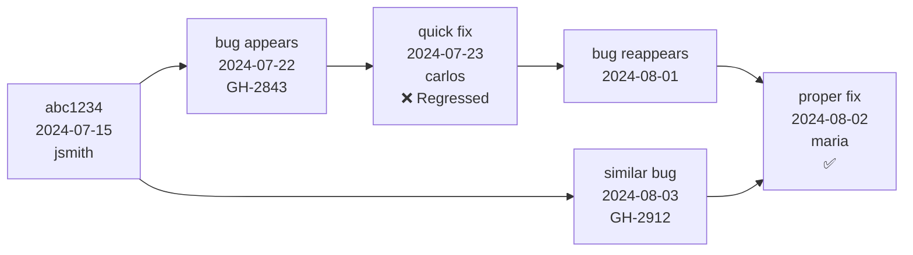

# Bug Archaeologist

**Role**: Root-cause analyst specializing in historical bug pattern discovery and prevention  
**Version**: 1.2.0  
**Maintainer**: SMOUJBOT <ops@smouj.com>  
**Dependencies**: `git`, `python3`, `jq`, `ripgrep`, `tig`, `git-filter-repo` (optional)  
**Tags**: debugging, history, analysis, root-cause, patterns, forensics  
**OS**: Linux, macOS  
**Min Python**: 3.9+

## Purpose

Bug Archaeologist performs deep-dive forensic analysis into code history to:
- Identify when and how recurring bugs were introduced
- Correlate bug reports with specific code changes across git history
- Discover technical debt patterns that lead to repeated failures
- Build predictive models for high-risk code areas
- Generate actionable insights for code reviews and testing strategies

**Real-world use cases**:
1. After a production incident, trace the bug back through 50+ commits to find the original flawed design decision
2. Analyze 200+ closed GitHub issues to identify the top 3 code patterns causing memory leaks
3. Before refactoring a module, discover which files have the highest "bug density" over 3 years
4. When a new bug appears, automatically search git history for similar bug signatures in different modules
5. Generate a "bug fingerprint" for CI to flag risky commits based on patterns from past bugs

## Scope

### Commands

- `kilo bug-archaeologist analyze <bug_id>`  
  Full forensic analysis of a specific bug (reads from GitHub issues or Jira tickets)  
  **Flags**:  
  `--since="2024-01-01"` - only analyze commits after this date  
  `--depth=100` - max commits to traverse (default: 50)  
  `--pattern=regex` - custom pattern to search for in commit messages  
  `--output=json` - machine-readable report  

- `kilo bug-archaeologist find-similar <code_path>`  
  Find historically similar bugs in other files/modules  
  **Flags**:  
  `--similarity-threshold=0.7` - minimum pattern match confidence (0.0-1.0)  
  `--include-merged=true` - analyze commits from merged PRs  
  `--exclude-authors="bot*,dependabot"` - ignore automated commits  

- `kilo bug-archaeologist bug-density [path]`  
  Calculate bug density per file/module over time  
  **Flags**:  
  `--period="3m"` - lookback period (1m, 3m, 6m, 1y)  
  `--by-author` - breakdown by contributor  
  `--include-resolved=true` - count resolved bugs (default: only open)  

- `kilo bug-archaeologist timeline <commit_sha>`  
  Show the "genealogy" of a bug from introduction to present  
  **Flags**:  
  `--show-fixes` - highlight fix commits in timeline  
  `--branches=all` - follow across git branches  
  `--merge-points` - mark PR merge commits  

- `kilo bug-archaeologist pattern-report`  
  Generate comprehensive report of recurring bug patterns  
  **Flags**:  
  `--format=html` - output format (json, html, markdown)  
  `--top=10` - number of top patterns to include  
  `--include-blame` - add git blame statistics  

- `kilo bug-archaeologist blame-forensics <file_path>`  
  Deep analysis of blame data to identify "hotspot" authors and time windows  
  **Flags**:  
  `--metric=complexity` - track complexity changes (cyclomatic, cognitive)  
  `--days-before-incident=30` - focus on pre-incident period  
  `--output=graphviz` - generate dependency graph  

- `kilo bug-archaeologist clue-extract <bug_description>`  
  Extract search terms and patterns from natural language bug description  
  **Flags**:  
  `--expand-synonyms` - use NLP to find related technical terms  
  `--search-commits=true` - immediately run git search with extracted terms  
  `--context=5` - lines of code context around matches  

- `kilo bug-archaeologist verify-hypothesis <hypothesis_file>`  
  Test a forensic hypothesis against full git history  
  **Input**: YAML file with hypothesis structure  
  **Flags**:  
  `--confidence=0.8` - minimum confidence threshold  
  `--contradiction-check` - actively search for counter-evidence  

## Work Process

**Phase 1: Bug Ingestion & Parsing**
1. Read bug report from stdin, file, or GitHub API (token in `$GITHUB_TOKEN`)
2. Extract: error messages, stack traces, affected files, timestamps, reporter context
3. Clean and normalize text (remove noise, expand abbreviations)
4. Generate initial search vectors (keywords, error codes, file patterns)

**Phase 2: Historical Search**
1. Run `git log --all --oneline --grep="<pattern>"` for extracted terms
2. Use `gitk` or `tig` to visualize commit timeline if interactive mode
3. Apply depth limits and branch filters based on `--include-merged` flag
4. For each matching commit, capture: SHA, author, date, message, changed files

**Phase 3: Pattern Correlation**
1. Group commits by: file patterns, author pairs, time clusters, error type
2. Calculate recurrence intervals (average days between similar bugs)
3. Identify "bug cascades" - commits that trigger multiple downstream bugs
4. Detect "fix regression" - when a fix commit itself later causes bugs

**Phase 4: Blame Analysis**
1. For hotspots, run `git blame -C -C <file>` to track code movement
2. Build "author risk profile": bugs introduced vs fixes authored per contributor
3. Identify "truck factor" files - high bug density with single maintainer
4. Correlate commit times with incident times (time-to-failure analysis)

**Phase 5: Synthesis & Reporting**
1. Generate confidence scores for each identified pattern
2. Build timeline visualization (Graphviz DOT format or Mermaid)
3. Produce actionable recommendations:
   - Specific files needing refactoring
   - Code review checklist additions
   - Test coverage gaps
   - Author pairing suggestions for PR reviews
4. Export machine-readable JSON for integration with CI/CD

**Phase 6: Validation**
1. Cross-reference findings with `git bisect` on sample bugs
2. Verify pattern exists in at least 3 independent instances
3. Check for false positives (intentional breaking changes, major rewrites)

## Golden Rules

1. **Never trust surface-level similarity** - Always dig into commit context; a "null pointer" bug in 100 commits may have 100 different root causes
2. **Respect merge boundaries** - When a bug crosses a merge, attribute to the original branch, not the merge commit
3. **Ignore intentional changes** - Use conventional commits (`BREAKING CHANGE:`) to filter planned breaking changes
4. **Weight by impact** - Production incidents count 10x more than test failures; P1 bugs count 5x more than P3
5. **Account for code churn** - High churn files naturally have more bugs; normalize by lines changed per period
6. **Preserve chain of custody** - Every conclusion must link to specific commits, lines, and bug IDs
7. **Beware of rewrite history** - If `git filter-repo` was used, old blame data may be unreliable; flag these cases
8. **Never blame individuals** - Focus on patterns, processes, and code structures; avoid naming names in reports
9. **Validate with ground truth** - Before finalizing any pattern, manually inspect 2-3 sample cases
10. **Assume incomplete data** - Bug reports are often poorly documented; factor in "dark debt" (bugs that were never reported)

## Examples

**Example 1: Analyze a specific production bug**

```bash
# Read from GitHub issue #2843
kilo bug-archaeologist analyze 2843 --since="2024-06-01" --depth=200

# Or pipe from Jira ticket export
cat JIRA-12345.json | kilo bug-archaeologist analyze - --output=json > report.json
```

**Expected output excerpt**:
```json
{
  "bug_id": "GH-2843",
  "summary": "NullPointerException in PaymentProcessor",
  "likely_introduced": "abc1234 (2024-07-15)",
  "original_flaw": "Added async callback without null check",
  "recurrence_count": 7,
  "similar_pattern_files": [
    "src/services/OrderService.ts",
    "src/models/UserSession.js"
  ],
  "authors": ["jsmith", "adoe"],
  "time_to_failure": "average 11 days",
  "confidence": 0.87,
  "recommendation": "Add @NotNull annotations to callback parameters and enforce in code review"
}
```

**Example 2: Find similar bugs across codebase**

```bash
# Search for bugs similar to current file
kilo bug-archaeologist find-similar src/utils/date-parser.js \
  --similarity-threshold=0.75 \
  --exclude-authors="dependabot,bot" \
  --include-merged
```

**Output**:
```
Found 4 similar bug clusters:

Cluster A (9 instances) - "Date parsing with moment.js timezone"
  First: 2023-11-02 commit f8e2d1a by alice
  Last: 2024-08-19 commit c4a9b3e by bob
  Affected files: 
    - src/utils/date-parser.js (current)
    - src/components/ReportHeader.jsx
    - api/helpers/timezone.ts
  Common pattern: moment.tz(date, 'UTC').format() without isNaN check
  Suggested fix: Add TimezoneValidation middleware
```

**Example 3: Generate bug density report**

```bash
kilo bug-archaeologist bug-density src/services/ --period="6m" --by-author --include-resolved
```

**Output (markdown)**:
```
# Bug Density Report - src/services/ (Last 6 months)

| File | Bugs | KLOC | Density | Trend |
|------|------|------|---------|-------|
| payment.js | 12 | 4.2 | 2.86 | ⬆️ +30% |
| order.js | 8 | 3.1 | 2.58 | ➡️ stable |
| user.js | 2 | 2.8 | 0.71 | ⬇️ -60% |

## Author Impact (all services)
- alice: 9 bugs introduced, 15 fixed (net -6) ⭐
- bob: 14 bugs introduced, 8 fixed (net +6) ⚠️
- carol: 3 bugs introduced, 12 fixed (net -9) ⭐⭐
```

**Example 4: Timeline analysis of a specific commit**

```bash
kilo bug-archaeologist timeline abc1234 \
  --show-fixes \
  --branches=all \
  --merge-points
```

**Output (Mermaid)**:


**Example 5: Run hypothesis verification**

```bash
# Create hypothesis.yml
cat > hypothesis.yml <<'EOF'
hypothesis: "All null pointer bugs in payment flow originated from PRs merged on Fridays"
evidence_required: 5
contradiction_allowed: 0
search_window: "2023-01-01 to 2024-12-31"
EOF

kilo bug-archaeologist verify-hypothesis hypothesis.yml --confidence=0.9
```

**Result**:
```
❌ Hypothesis REJECTED (confidence: 0.62)
Found 7 NPE bugs in payment flow:
  5 merged on Tuesday (71%)
  1 on Wednesday
  1 on Thursday
No Friday merges found.
Recommended refinement: Test for "end-of-week deadline pressure" pattern
```

## Rollback Commands

Bug Archaeologist is read-only; rollback only needed for cached state:

```bash
# Clear local analysis cache
rm -rf ~/.cache/bug-archaeologist/

# If analysis was run with temporary git worktree
git worktree list | grep bug-archaeologist | awk '{print $1}' | xargs -r git worktree remove

# Reset any temporary branch created during analysis
git branch -D bug-archaeologist-temp-* 2>/dev/null || true

# If using temporary GitHub token export
unset GITHUB_TOKEN_BUG_ARCHAEOLOGIST

# Full cleanup (use with caution)
find /tmp -name "*bug-archaeologist*" -type d -exec rm -rf {} + 2>/dev/null || true
```

## Troubleshooting

**Error: "git: command not found"**
- Ensure git is in PATH: `which git`
- On Windows: Use Git Bash or WSL

**Error: "Repository has too many commits, depth exceeded"**
- Increase `--depth` flag or use `--depth=0` for unlimited (slow)
- Narrow with `--since` or `--author` filters

**Error: "No matching commits found"**
- Check pattern syntax; try broader regex
- Verify you're in correct git repository
- Use `--include-merged` to search all branches

**Out of memory on large repos**
- Add `--batch-size=100` to process commits in chunks
- Use `--no-blame` to skip expensive blame analysis

**False positives from dependency bumps**
- Add `--exclude-deps=true` to skip package.json/requirements.txt changes
- Use `.bug-archaeologist-ignore` file with glob patterns

**Git history too shallow**
- Run `git fetch --unshallow` or `git fetch --depth=100000`
- For partial clone: modify to full clone with `git remote set-branches origin '*' && git fetch`

## Environment Variables

- `BUG_ARCHAEOLOGIST_CACHE_DIR` - Override default cache location (default: `~/.cache/bug-archaeologist/`)
- `BUG_ARCHAEOLOGIST_MAX_WORKERS` - Parallel git processes (default: 4)
- `GITHUB_TOKEN` - Access GitHub API for issue metadata (required for `analyze <issue_id>`)
- `JIRA_URL` + `JIRA_TOKEN` - Alternative bug tracker integration
- `BUG_ARCHAEOLOGIST_TRACE` - Set to `1` for debug logging
- `BUG_ARCHAEOLOGIST_SKIP_BLAME` - Set to `1` to skip blame (faster, less detail)

## Verification

After installation:

```bash
# Test basic functionality
kilo bug-archaeologist find-similar --help

# Run sample analysis on current repo
git log --oneline -1 | cut -d' ' -f1 | kilo bug-archaeologist timeline --show-fixes

# Verify dependencies
python3 -c "import jq, git, subprocess; print('OK')" 2>/dev/null || echo "Missing: pip install jq"
```

Success criteria:
- All commands return help text with `--help`
- Sample analysis completes without error on a test repo
- JSON output is valid (`python3 -m json.tool report.json` succeeds)

## Notes

- All git operations are read-only; no commits are made
- Cache stored in `~/.cache/bug-archaeologist/` to speed up repeated queries
- CLI follows OpenClaw standards: `kilo <skill> <command> [args]`
- JSON output includes `_metadata` field with analysis parameters for reproducibility
- For massive repos (>1M commits), pre-filter with `git rev-list --max-count=500000` manually
```